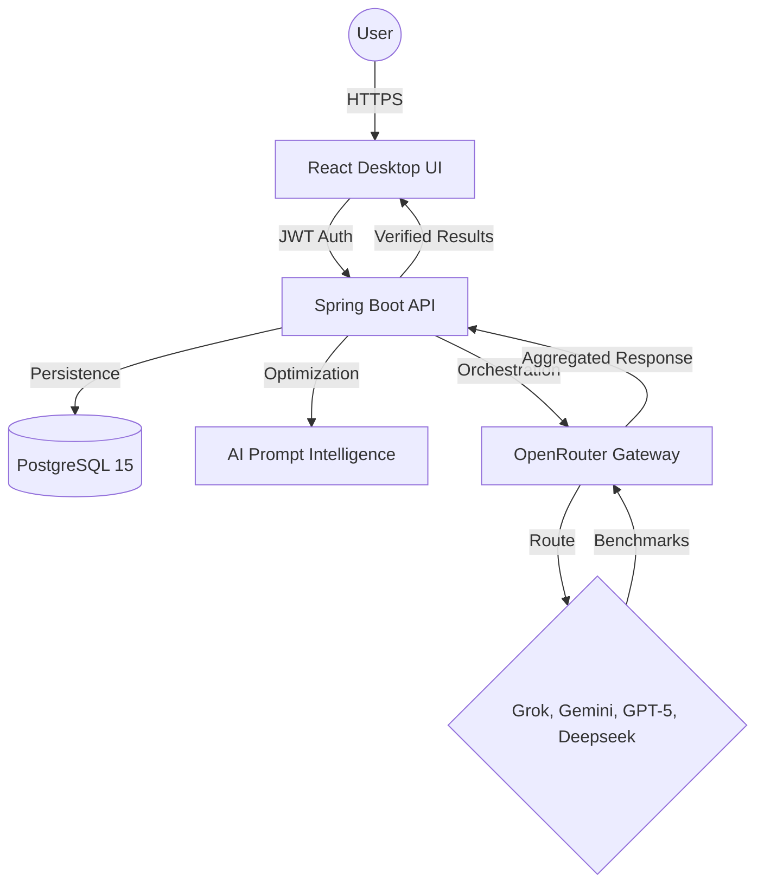

# 🤖 AI Nexus: The Industrial-Grade Intelligence Hub

AI Nexus is a high-performance, full-stack AI orchestration platform. It enables real-time comparison across state-of-the-art models (Grok, Gemini, GPT-5, Deepseek) while capturing deep performance metrics to identify the most efficient intelligence for any task.

 <!-- Replace with actual image if available -->

## 💎 World-Class Features

### ⚖️ Multi-Model Benchmarking
Query multiple models simultaneously and compare their **latency (ms)** and **throughput (tokens/sec)** live. Identify which AI is fastest and most efficient for your specific queries.

### 📊 Intelligence Analytics
- **Personal Pulse**: Deep insights into your interaction trends, model reach, and aggregate efficiency.
- **Global Leaderboard**: See real-time "Market Share" and performance rankings across the entire AI Nexus network.

### 🧠 Prompt Intelligence
- **Real-time Quality Meter**: Get instant feedback on your prompt strength before you send it.
- **Master Rewrite (✨)**: Use AI to professionally optimize and restructure your prompts for better results.
- **Expert Advice Mode**: Orchestrate models to provide deeper technical insights and critical analysis.

### 🌑 Luxury Aesthetics
- **Premium Pure Black Theme**: A high-contrast, sophisticated workspace designed for professional use.
- **Glassmorphic UI**: Modern, responsive interface with smooth transitions and rounded aesthetics.

---

## 🏗️ Industrial-Grade Architecture

AI Nexus is built on a scalable, high-trust stack designed for persistence and performance.

### Tech Stack
- **Frontend**: React 18, TypeScript, Tailwind CSS, Zustand, Recharts.
- **Backend**: Java 21, Spring Boot 3, Spring Security (JWT + OAuth2), Spring Data JPA.
- **Database**: PostgreSQL 15 (Containerized).
- **Orchestration**: Docker & Docker Compose.
- **AI Gateway**: OpenRouter API.

### Workflow Diagram


---

## 🚀 Getting Started (Docker)

AI Nexus is fully containerized for a "Plug & Play" experience.

### Prerequisites
- [Docker Desktop](https://www.docker.com/products/docker-desktop/) installed and running.

### Installation
1. **Clone the repository**:
   ```bash
   git clone https://github.com/Anand001122/AI-Nexus.git
   cd AI-Nexus
   ```

2. **Configure Environment**:
   Update the `.env` file with your API keys and configuration:
   ```env
   # Backend
   DEEPSEEK_APIKEY=your_key
   OPENAI_APIKEY=your_key
   GROK_APIKEY=your_key
   GEMINI_APIKEY=your_key
   GOOGLE_CLIENT_ID=your_id
   GOOGLE_CLIENT_SECRET=your_secret
   
   # Frontend
   VITE_API_BASE_URL=http://localhost:8080/api
   ```

3. **Launch the Hub**:
   ```bash
   docker-compose up --build -d
   ```

4. **Access the App**:
   - **Frontend**: [http://localhost:5173](http://localhost:5173)
   - **API Docs**: [http://localhost:8080/v3/api-docs](http://localhost:8080/v3/api-docs)

---

## 🛠️ Database Management
The system uses a persistent PostgreSQL volume. You can inspect the data directly via Docker:
```bash
# List all registered users
docker exec -it ai-nexus-db psql -U postgres -d ai_nexus -c "SELECT email, full_name, is_premium FROM users;"

# View latest model performance
docker exec -it ai-nexus-db psql -U postgres -d ai_nexus -c "SELECT ai_model, response_time_ms, tokens_per_second FROM chat_messages WHERE is_user = false ORDER BY timestamp DESC LIMIT 5;"
```

---
*Created with ❤️ by [Anand Hiremath](https://github.com/Anand001122)*
