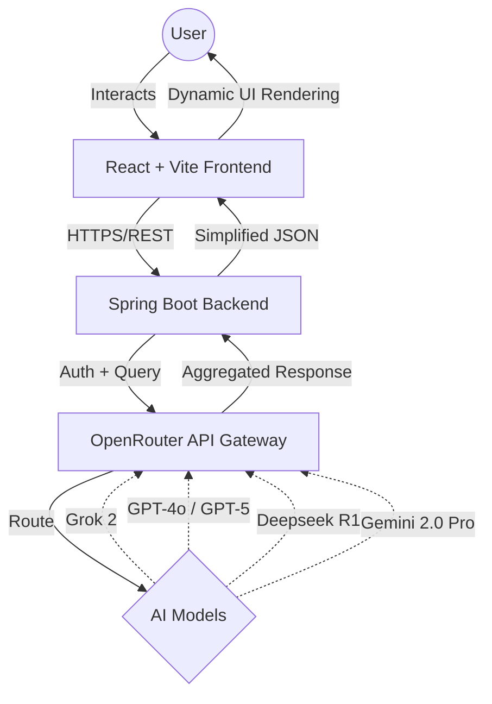

# 🤖 AI Nexus: Multi-Model Intelligence Hub

AI Nexus is a professional-grade, full-stack AI orchestration platform. It allows users to query multiple state-of-the-art AI models (Grok, Gemini, GPT-5, and Deepseek) simultaneously, comparing results in a sleek, side-by-side glassmorphism interface.

## 🚀 Live Demo
*   **Web Portal**: [https://chat-grid.vercel.app/](https://chat-grid.vercel.app/) (Legacy)
*   **Production Deployment**: [https://ai-nexus-frontend.netlify.app/](https://ai-nexus-frontend.netlify.app/)

---

## 🏗️ Architecture & Workflow

AI Nexus follows a modern distributed architecture, separating concerns between a responsive frontend, a robust Java-based orchestration layer, and global AI model providers.

### Workflow Diagram


---

## 💻 Tech Stack

### Frontend (User Interface)
- **Framework**: React 18 with TypeScript
- **Styling**: Tailwind CSS (Custom Glassmorphism Design)
- **State Management**: Zustand (Global Chat Store)
- **Icons**: Lucide React
- **Build Tool**: Vite

### Backend (Orchestration)
- **Language**: Java 21 (Eclipse Temurin)
- **Framework**: Spring Boot 3.4.2
- **Networking**: Java 11 HttpClient
- **Build Tool**: Maven

### Infrastructure & DevOps
- **Hosting**: Netlify (Frontend) & Render (Backend)
- **CI/CD**: GitHub Actions & Jenkins
- **Quality**: SonarCloud Quality Gate Integration
- **Containerization**: Docker (Dockerized Spring Boot environment)

---

## 🔋 Supported AI Models

| Model Identity | Internal ID | Capabilities |
| :--- | :--- | :--- |
| **Grok 2.1** | `x-ai/grok-2-1212` | Real-time knowledge and coding assistance. |
| **GPT-5 Chat** | `openai/gpt-4o` | High-level reasoning and instruction following. |
| **Deepseek R1** | `deepseek/deepseek-r1:free` | Advanced open-source logic and math. |
| **Gemini 2.5 Pro** | `google/gemini-2.0-pro-exp` | Large context windows and multimodal tasks. |

---

## 🛠️ Requirements & Installation

### Local Prerequisites
- **Node.js**: v18.0.0 or higher
- **JDK**: Java 17 or higher (Java 21 recommended)
- **Maven**: 3.8.1+ (or use `./mvnw`)

### Configuration
1.  **Backend Env Vars**: Create environment variables for:
    - `Deepseek_APIKEY`
    - `OpenAI_APIKey`
    - `Grok_APIKEY`
    - `GEMINI_APIKEY`
2.  **Frontend Env Vars**: Create a `.env` file in `/frontend`:
    ```env
    VITE_API_BASE_URL=http://localhost:8080/api
    ```

### Running Locally
1.  **Start Backend**:
    ```bash
    cd backend
    ./mvnw spring-boot:run
    ```
2.  **Start Frontend**:
    ```bash
    cd frontend
    npm install
    npm run dev
    ```

---

## 🛡️ Security & CORS
The application implements a strict Global CORS policy, allowing only verified origins from **Netlify** and **Vercel** to communicate with the production API. API keys are never exposed to the client-side and remain secured within the server-side environment.

---
*Created with ❤️ by Anand Hiremath*
